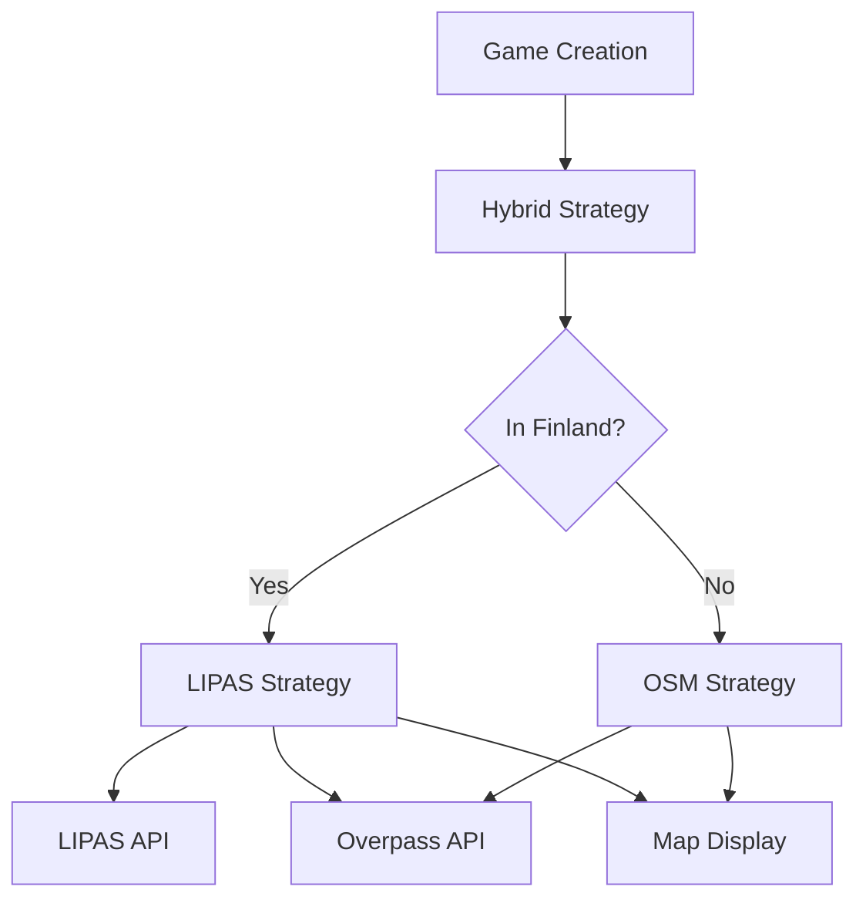

# LIPAS Finland Trail Integration System

## Overview

**LIPAS (Liikuntapaikkojen paikkatietojärjestelmä)** is Finland's national sports facilities geographic information system, containing data on ~43,000 sports facilities, outdoor routes, and recreation areas. The database is:

- ✅ **Open data** (CC BY 4.0 license)
- ✅ **Maintained by University of Jyväskylä**
- ✅ **Provides REST, WFS, and WMS APIs**
- ✅ **Free to use with attribution**

According to [University of Jyväskylä](https://www.jyu.fi/en/node/129134/lipas-liikunnan-paikkatietojarjestelma), LIPAS data is open and accessible, similar to how [Trailmap.fi](https://web.trailmap.fi/) successfully combines OpenStreetMap, Maanmittauslaitos, and LIPAS.

## Current System Analysis

### Existing Map Infrastructure

**Map Tile Layers** ([app/game/components/leaflet/MapTileLayers.tsx](app/game/components/leaflet/MapTileLayers.tsx)):

- Maanmittauslaitos (MML) terrain maps (Finland-only, requires API key)
- OpenStreetMap base layer
- User preference system for layer selection

**Point Generation** ([app/background/strategies/osm.strategy.ts](app/background/strategies/osm.strategy.ts)):

- Uses Overpass API to fetch OSM features (peaks, towers, historic sites)
- Generates 4-7 waypoints along corridors
- Prioritizes distinct landmarks for goal placement
- AI-generated hints using Google Gemini

**Game AI System** ([app/background/game_ai.ts](app/background/game_ai.ts)):

- Strategy pattern supporting multiple point generation approaches
- Currently: `random` (basic) and `osm` (advanced)
- Can mix strategies (not yet implemented)

## Implementation Plan

### Phase 1: LIPAS Backend Integration

#### 1.1 Create LIPAS API Client

Create [`lib/api/lipas.ts`](lib/api/lipas.ts) to interface with LIPAS REST API:

```typescript
// LIPAS API endpoint (based on open data standards)
const LIPAS_API_BASE = 'https://lipas.cc.jyu.fi/api';

interface LIPASFacility {
  'type-code': number;
  name: string;
  location: {
    coordinates: {
      wgs84: { lat: number; lon: number }
    }
  };
  properties: {
    'route-length-km'?: number;
    'surface-material'?: string;
    'lighting'?: boolean;
  };
}

// Fetch outdoor routes and trails
// Type codes: 4401-4490 (outdoor routes), 4101-4199 (trails)
async function fetchLIPASRoutes(bbox: BoundingBox): Promise<LIPASFacility[]>
```

**Key LIPAS facility types for Wild Trails:**

- 4401: Nature trails (luontopolut)
- 4411: Hiking trails (vaellusreitit)
- 4421: Mountain biking trails
- 4405: Ski trails (usable as summer routes)
- 4404: Exercise routes

#### 1.2 Create LIPAS Point Generation Strategy

Create [`app/background/strategies/lipas.strategy.ts`](app/background/strategies/lipas.strategy.ts):

```typescript
export class LIPASStrategy implements PointGenerationStrategy {
  async generatePoints(game: Game, options?: PointGenerationOptions): Promise<GamePoint[]> {
    // 1. Fetch LIPAS routes within game bounds
    // 2. Select primary route based on difficulty:
    //    - Easy: nature trails, exercise routes (well-marked)
    //    - Medium: longer hiking trails
    //    - Hard: challenging terrain, off-trail
    // 3. Generate waypoints along selected route(s)
    // 4. Enrich with OSM landmark data for hints
    // 5. Generate AI hints with LIPAS context
  }
}
```


#### 1.3 Create Hybrid Strategy

Create [`app/background/strategies/hybrid.strategy.ts`](app/background/strategies/hybrid.strategy.ts) to combine LIPAS + OSM:

```typescript
export class HybridStrategy implements PointGenerationStrategy {
  async generatePoints(game: Game, options?: PointGenerationOptions): Promise<GamePoint[]> {
    // 1. Check if game area is in Finland (bounding box check)
    // 2. If Finland: Use LIPAS for route structure + OSM for landmarks
    // 3. If outside: Fall back to pure OSM strategy
    // 4. Provide better hints by combining both datasets
  }
}
```

This strategy makes LIPAS the **primary source for trail structure** in Finland, while using OSM for **landmark enrichment** and **international coverage**.

#### 1.4 Update Game AI

Update [`app/background/game_ai.ts`](app/background/game_ai.ts):

```typescript
private strategies = {
  random: new RandomStrategy(),
  osm: new OSMStrategy(),
  lipas: new LIPASStrategy(),
  hybrid: new HybridStrategy(), // NEW: Recommended default
};
```

Change default strategy from `osm` to `hybrid` for automatic Finland detection.

### Phase 2: Enhanced Map Visualization

#### 2.1 Add LIPAS Overlay Layer

Update [`app/game/components/leaflet/MapTileLayers.tsx`](app/game/components/leaflet/MapTileLayers.tsx) to add LIPAS WMS overlay:

```typescript
<LayersControl.Overlay name="LIPAS Trails" checked={true}>
  <WMSTileLayer
    url="https://lipas.cc.jyu.fi/geoserver/lipas/wms"
    layers="lipas:outdoor_routes"
    format="image/png"
    transparent={true}
    attribution='&copy; <a href="https://www.jyu.fi/lipas">LIPAS</a> (CC BY 4.0)'
  />
</LayersControl.Overlay>
```

This displays official trail routes **on top of** the base map, giving players visual context for marked trails vs off-trail exploration.

#### 2.2 Add Trail Route Polylines

Create [`app/game/components/leaflet/TrailOverlay.tsx`](app/game/components/leaflet/TrailOverlay.tsx) to display active game route:

```typescript
export function TrailOverlay({ 
  trailData, 
  highlightedSegment 
}: TrailOverlayProps) {
  // Display LIPAS route as colored polyline
  // Highlight current game segment (start to next waypoint)
  // Show trail difficulty indicator
  // Add trail name popup
}
```


#### 2.3 Enhanced Point Display

Update waypoint markers to show **trail context**:

- "On official trail" vs "Off-trail exploration"
- Distance from nearest marked trail
- Trail name if applicable

### Phase 3: UI/UX Improvements

#### 3.1 Map Layer Selector Enhancement

Update user preferences to include:

- LIPAS trails overlay (on/off)
- Trail difficulty filter (show only easy/medium/hard routes)
- Route type filter (hiking, biking, ski trails)

#### 3.2 Game Creation Wizard Updates

Update [`app/game/create/page.tsx`](app/game/create/page.tsx) game creation to show:

- **Visual indicator** when creating game in Finland (LIPAS available)
- **Trail preview** on map selection screen
- **Route suggestions** from LIPAS database
- **Auto-snap option** to align game with existing trail

#### 3.3 Game Info Display

Show trail information in game UI:

- Trail name (e.g., "Pyhä-Luosto National Park Trail")
- Total route length from LIPAS
- Surface type (gravel, dirt, maintained)
- Lighting availability

### Phase 4: Data Caching & Performance

#### 4.1 LIPAS Data Cache

Create [`lib/cache/lipas-cache.ts`](lib/cache/lipas-cache.ts):

- Cache LIPAS API responses (24-hour TTL)
- Store commonly accessed routes in Supabase
- Reduce API calls during game creation

#### 4.2 Preload Popular Areas

Create cron job to preload LIPAS data for popular regions:

- Helsinki metropolitan area
- National parks
- Major cities
- Popular hiking destinations

### Phase 5: Testing & Documentation

#### 5.1 Tests

Create test files:

- [`__tests__/lib/api/lipas.test.ts`](__tests__/lib/api/lipas.test.ts) - API client tests
- [`__tests__/background/strategies/lipas.strategy.test.ts`](__tests__/background/strategies/lipas.strategy.test.ts) - Strategy tests
- [`__tests__/background/strategies/hybrid.strategy.test.ts`](__tests__/background/strategies/hybrid.strategy.test.ts) - Hybrid strategy tests

#### 5.2 Documentation

Update documentation:

- [`README.md`](README.md) - Add LIPAS attribution and feature description
- [`docs/api-reference.md`](docs/api-reference.md) - Document LIPAS endpoints
- Create [`docs/lipas-integration.md`](docs/lipas-integration.md) - Technical details

## Technical Architecture




## Data Attribution

Add to all map displays:

```html
Trail data © LIPAS / University of Jyväskylä (CC BY 4.0)
Map data © OpenStreetMap contributors
Terrain maps © Maanmittauslaitos
```


## Environment Variables

Add to `.env.local` (optional - LIPAS is open API):

```env
# LIPAS (optional - open API, no key required)
LIPAS_API_BASE_URL=https://lipas.cc.jyu.fi/api

# Cache configuration
LIPAS_CACHE_TTL_HOURS=24
```


## Benefits

1. **Better Finland Coverage**: Access to 43,000+ official outdoor routes
2. **Improved Game Quality**: Games follow real trails instead of random points
3. **Player Experience**: Clear trail names and context
4. **International Ready**: Hybrid strategy gracefully falls back outside Finland
5. **Open Source Friendly**: Free, open data with proper attribution
6. **Scalability**: Can add more regional databases (similar to Trailmap.fi approach)

## Future Enhancements

- **Trailmap.fi Partnership**: Contact for enhanced tile layers or API access
- **MapAnt.fi Integration**: Add detailed orienteering map layers
- **International Trail DBs**: Add AllTrails API, Hiking Project, Komoot
- **Trail Conditions**: Integrate real-time trail status from LIPAS