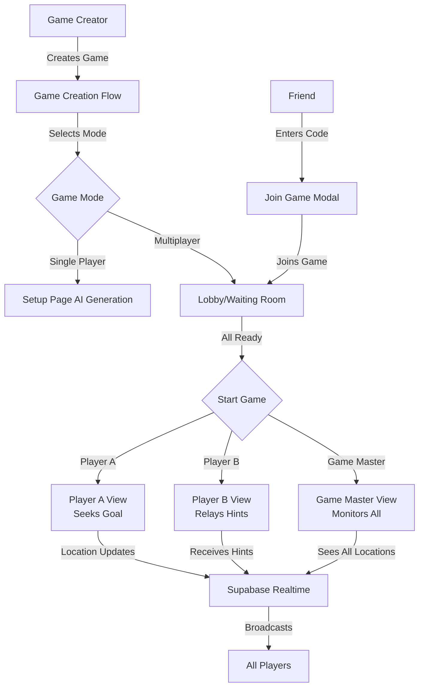

# Multiplayer Implementation: Phase 2A + 2B

## Overview

This plan implements multiplayer functionality for Wild Trails, enabling 2-3 friends to play together with distinct roles (Player A, Player B, Game Master). We'll build on the existing foundation where the join game UI and API already exist, but need enhancement for full multiplayer support with role differentiation.

## Current State

**What's Working:**

- Join game modal exists ([`app/components/JoinGameModal.tsx`](app/components/JoinGameModal.tsx))
- Join game API endpoint ([`app/api/game/[id]/join/route.ts`](app/api/game/[id]/join/route.ts))
- Database schema supports roles and player status
- Realtime is enabled for `players`, `games`, and `game_points` tables
- Role selection UI in game settings (currently disabled for multiplayer)

**What Needs Work:**

- Remove single-player restriction in join flow
- Build lobby/waiting room with real-time player updates
- Implement role-specific views during gameplay
- Add game mode selection in creation flow
- Handle role assignment logic
- Sharable game links/codes

## Architecture




## Phase 2A: Core Multiplayer Infrastructure

### 1. Database Schema Updates

**Add new fields to `games` table:**

- `game_code` (text, unique): Short 6-character code for easy sharing (e.g., "WILD42")
- `is_public` (boolean, default false): For Phase 3, prepare now
- `max_players` (integer, default from player_count): Allow flexibility

**Migration file:** `supabase/migrations/YYYYMMDDHHMMSS_multiplayer_support.sql`

```sql
ALTER TABLE games ADD COLUMN game_code TEXT UNIQUE;
ALTER TABLE games ADD COLUMN is_public BOOLEAN DEFAULT FALSE;
ALTER TABLE games ADD COLUMN max_players INTEGER DEFAULT 1;

-- Create index for faster game code lookups
CREATE INDEX games_game_code_idx ON games(game_code);

-- Function to generate unique game code
CREATE OR REPLACE FUNCTION generate_game_code() RETURNS TEXT AS $$
DECLARE
    chars TEXT := 'ABCDEFGHJKLMNPQRSTUVWXYZ23456789';
    result TEXT := '';
    i INTEGER;
BEGIN
    FOR i IN 1..6 LOOP
        result := result || substr(chars, floor(random() * length(chars) + 1)::int, 1);
    END LOOP;
    RETURN result;
END;
$$ LANGUAGE plpgsql;
```

**Update RLS policies:**

- Modify "Users can read their own games" to include games where user is a player
- Add policy for reading games by game_code (for join flow)

### 2. Remove Single-Player Restriction

**File:** [`app/components/JoinGameModal.tsx`](app/components/JoinGameModal.tsx)**Changes:**

- Remove lines 44-50 (multiplayer restriction check)
- Add role selection step after password validation
- Show available roles based on game configuration
- Update to use game_code instead of full UUID

**New flow:**

1. Enter game code (6 characters, not UUID)
2. Enter password if required
3. Select available role
4. Join game → Redirect to lobby

### 3. Enhanced Join Game API

**File:** [`app/api/game/[id]/join/route.ts`](app/api/game/[id]/join/route.ts)**Enhancements:**

- Validate player hasn't exceeded max_players limit
- Check role availability (no duplicate Player A, etc.)
- Return game details including current players
- Trigger Realtime notification to lobby

### 4. Game Creation Updates

**File:** [`app/game/create/components/GameSettings.tsx`](app/game/create/components/GameSettings.tsx)**Changes:**

- Enable player count options (2, 3 players)
- Update game mode based on player count:
- 1 player → `single_player`
- 2 players → `two_player`
- 3+ players → `multi_player`
- Show/hide role selection based on player count
- Add "Generate game code" toggle (auto-generate by default)

**File:** [`app/game/create/page.tsx`](app/game/create/page.tsx)**Changes:**

- Include `game_code` generation in API call
- Include `max_players` field
- Set `game_mode` based on player count

### 5. Lobby/Waiting Room

**New file:** `app/game/[id]/lobby/page.tsx`**Purpose:** Pre-game waiting room where players gather before game starts.**Features:**

- Display game code prominently with "Copy Code" button
- Real-time player list with status indicators (waiting/ready)
- Role badges for each player
- "I'm Ready" button for each player
- "Start Game" button (only for creator, enabled when all ready OR creator can force start)
- Kick player button (creator only)
- Game settings summary

**Realtime subscription:**

```typescript
const channel = supabase
  .channel(`game:${gameId}:lobby`)
  .on('postgres_changes', {
    event: '*',
    schema: 'public',
    table: 'players',
    filter: `game_id=eq.${gameId}`
  }, (payload) => {
    // Update player list
  })
  .subscribe();
```


### 6. Update Setup Page Flow

**File:** [`app/game/[id]/setup/page.tsx`](app/game/[id]/setup/page.tsx)**Changes:**

- Check if `game_mode === 'single_player'`:
- YES → Show current setup flow (AI generation or GM setup)
- NO → Redirect to lobby page
- Update PlayerView to redirect multiplayer games to lobby

## Phase 2B: Game Modes & Role-Specific Views

### 7. Role System Constants

**New file:** `lib/game/roles.ts`

```typescript
export type GameRole = 'player_a' | 'player_b' | 'game_master';

export const ROLE_PERMISSIONS = {
  player_a: {
    canSeeOwnLocation: true,
    canSeeGoalLocation: false,
    canSeeOtherPlayers: true,
    canRequestHints: true,
    canSeeHints: false, // Gets hints from Player B
  },
  player_b: {
    canSeeOwnLocation: true,
    canSeeGoalLocation: true, // Sees goal from start
    canSeeOtherPlayers: true,
    canRequestHints: false,
    canSeeHints: true, // Receives hints to relay
  },
  game_master: {
    canSeeOwnLocation: true,
    canSeeGoalLocation: true,
    canSeeOtherPlayers: true,
    canRequestHints: false,
    canSeeHints: true,
    canManuallyTriggerHints: true,
    canEditPoints: true,
  }
};
```


### 8. Multiplayer Game Play - Role Views

**File:** [`app/game/[id]/play/page.tsx`](app/game/[id]/play/page.tsx)**Major changes:**

- Add role-based conditional rendering
- Subscribe to all players' locations (for roles that can see them)
- Different map overlays based on role

**New hooks:**

- `useMultiplayerLocations(gameId)`: Subscribe to all player locations
- `useRolePermissions(role)`: Get permissions for current role

**Role-specific components:New file:** `app/game/[id]/play/components/PlayerAView.tsx`

- Shows own location
- Shows waypoints as discovered
- Requests hints (button triggers hint generation)
- Does NOT see goal until reached
- Sees Player B location (for coordination)

**New file:** `app/game/[id]/play/components/PlayerBView.tsx`

- Shows own location (at goal)
- Sees goal location from start
- Receives hints when Player A requests them
- Displays hints with "Relay to Player A" interface
- Sees Player A location

**New file:** `app/game/[id]/play/components/GameMasterView.tsx`

- Enhanced from setup view
- Sees all player locations in real-time
- Can manually trigger hints
- Can mark points as discovered
- Overview dashboard with player stats

### 9. Real-time Location Sharing

**File:** [`hooks/usePlayerLocation.ts`](hooks/usePlayerLocation.ts)**Enhancements:**

- Store location updates in `player_locations` table (already exists!)
- Broadcast updates via Realtime
- Add throttling (update every 10 seconds max during active movement)

**New file:** `hooks/useMultiplayerLocations.ts`

```typescript
export function useMultiplayerLocations(gameId: string, playerId: string) {
  const [playerLocations, setPlayerLocations] = useState<Map<string, Location>>();
  
  useEffect(() => {
    const channel = supabase
      .channel(`game:${gameId}:locations`)
      .on('postgres_changes', {
        event: 'INSERT',
        schema: 'public',
        table: 'player_locations',
        filter: `game_id=eq.${gameId}`
      }, (payload) => {
        // Update location for player
      })
      .subscribe();
      
    return () => { supabase.removeChannel(channel); };
  }, [gameId]);
  
  return { playerLocations };
}
```


### 10. Hint System for Multiplayer

**File:** `app/api/game/[id]/request-hint/route.ts` (new)**Purpose:** Player A requests a hint, which gets sent to Player B or AI.**Flow:**

1. Player A clicks "Request Hint"
2. API generates hint using AI (similar to existing hint generation)
3. If Player B exists:

- Hint sent to Player B's view
- Player B can relay it (or modify it!)
- Push notification to Player B

4. If no Player B (or AI mode):

- Hint displayed directly to Player A

### 11. Game Modes Configuration

**Update:** [`app/game/create/components/GameSettings.tsx`](app/game/create/components/GameSettings.tsx)**Add game mode presets:Two-Player Cooperative:**

- Both players are player_a role
- Both see same information
- Both can request hints
- Work together to reach goal

**Two-Player A+B:**

- Player A at start (seeks goal)
- Player B at goal (relays hints)
- Communication encouraged

**Three-Player with GM:**

- Player A seeks goal
- Player B at goal
- Human Game Master monitors and can intervene

### 12. Shareable Game Links

**New component:** `app/game/[id]/components/ShareGameCard.tsx`**Features:**

- Display game code prominently
- "Copy Link" button: `https://wildtrails.app/join/WILD42`
- QR code (optional, nice-to-have)
- "Share via..." buttons (native share API)

**New route:** `app/join/[code]/page.tsx`

- Redirects to join modal with code pre-filled
- Better UX than copy-pasting code

### 13. Game Results for Multiplayer

**File:** [`app/game/[id]/results/page.tsx`](app/game/[id]/results/page.tsx)**Enhancements:**

- Show all players' paths on map
- Individual stats per player
- Team stats (if cooperative mode)
- "Play again with same group" button

## Technical Considerations

### Realtime Optimization

- Use presence tracking for "player is online" status
- Throttle location updates (every 10s instead of every second)
- Only subscribe to necessary channels

### Error Handling

- Handle player disconnection gracefully
- Show "Player X is offline" indicator
- Allow game to continue if one player drops

### Testing Strategy

1. **Unit tests:** Role permission logic
2. **Integration tests:** Join game flow, lobby updates
3. **E2E tests:** 

- Create game → Friend joins → Both ready → Start → Play
- Test with 2 real devices for location tracking

### Security

- Validate role assignments server-side (don't trust client)
- Check max_players limit in join API
- Verify only creator can kick players

## Implementation Order

### Phase 2A (Core Infrastructure)

1. Database migration + game code generation
2. Remove single-player restriction in join modal
3. Update join API with role validation
4. Build lobby/waiting room page
5. Update game creation to support multiplayer modes

### Phase 2B (Game Modes & Roles)

6. Create role system constants and permissions
7. Build `useMultiplayerLocations` hook
8. Implement Player A view component
9. Implement Player B view component
10. Implement Game Master view component
11. Add hint request API for multiplayer
12. Build shareable game link system
13. Update results page for multiplayer

## Files to Create

**New Files:**

- `supabase/migrations/YYYYMMDDHHMMSS_multiplayer_support.sql`
- `app/game/[id]/lobby/page.tsx`
- `app/game/[id]/lobby/components/PlayerList.tsx`
- `app/game/[id]/lobby/components/GameCodeDisplay.tsx`
- `app/game/[id]/play/components/PlayerAView.tsx`
- `app/game/[id]/play/components/PlayerBView.tsx`
- `app/game/[id]/play/components/GameMasterMultiplayerView.tsx`
- `app/game/[id]/components/ShareGameCard.tsx`
- `app/join/[code]/page.tsx`
- `app/api/game/[id]/request-hint/route.ts`
- `app/api/game/[id]/kick-player/route.ts`
- `hooks/useMultiplayerLocations.ts`
- `hooks/useLobby.ts`
- `lib/game/roles.ts`

**Files to Modify:**

- `app/components/JoinGameModal.tsx`
- `app/api/game/[id]/join/route.ts`
- `app/game/create/components/GameSettings.tsx`
- `app/game/create/page.tsx`
- `app/game/[id]/setup/page.tsx`
- `app/game/[id]/setup/components/PlayerView.tsx`
- `app/game/[id]/play/page.tsx`
- `app/game/[id]/results/page.tsx`
- `hooks/usePlayerLocation.ts`
- `lib/api/client.ts` (add new API methods)

## Success Metrics

- Creator can create a 2-player game and share code
- Friend can join via game code
- Both players see each other in lobby with real-time updates
- Game starts when both ready
- Player A sees their location, Player B sees goal
- Location updates flow in real-time between players
- Game completes successfully with both players' stats

## Estimated Effort

- Phase 2A: 2-3 weeks
- Phase 2B: 2-3 weeks
- Total: 4-6 weeks

## Future Extensions (Phase 2C - Not in this plan)

- Discord webhook integration
- Slack notifications
- Email invitations