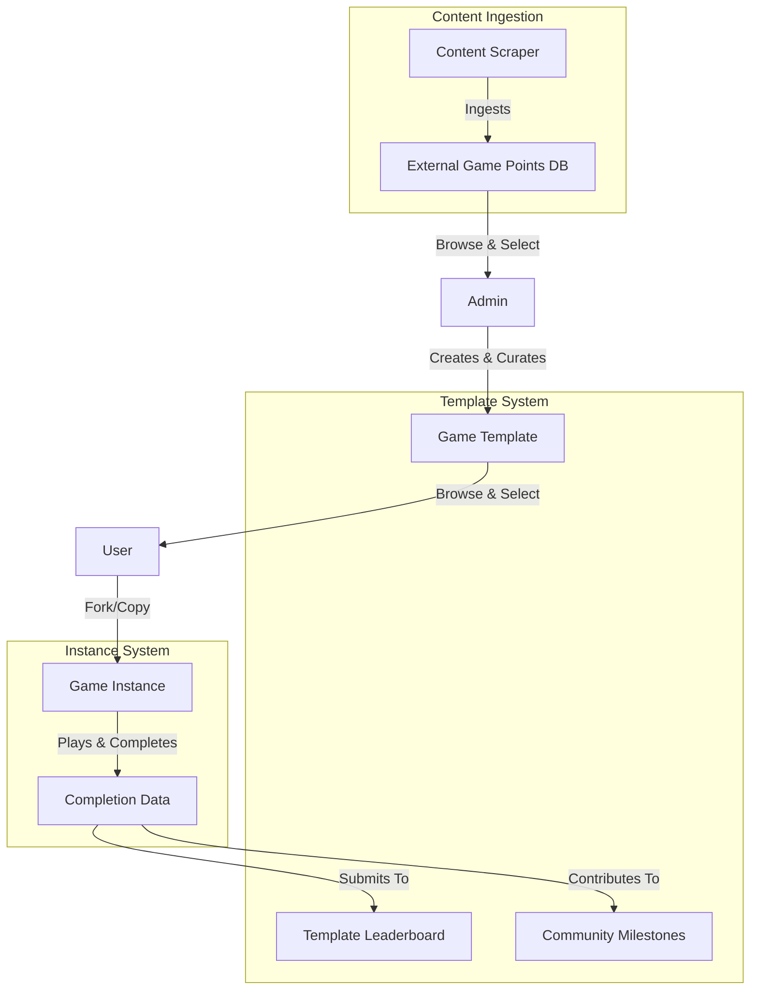

# Public Templates & Curated Games Implementation Plan

## Overview

Transform Wild Trails from "private-only games" to a **Template & Instance** model that solves the "empty lobby problem." Instead of waiting for players to join public games, users browse a curated gallery of game templates and create their own private instances to play solo or with friends.

## Architecture




## Database Schema Changes

### New Tables

**game_templates**

- `id` (uuid, primary key)
- `name` (text, required)
- `description` (text, nullable) - Rich description/story
- `creator_id` (uuid, foreign key to auth.users) - Admin who created it
- `is_published` (boolean, default false) - Visibility flag
- `bounding_box` (jsonb, required) - Geographic area
- `starting_point` (jsonb, nullable) - Fixed start location
- `duration` (integer, required) - Expected duration in minutes
- `max_radius` (integer, required) - Max distance in meters
- `difficulty` (enum: 'easy', 'medium', 'hard', nullable)
- `tags` (text[], nullable) - ['forest', 'urban', 'historical']
- `preview_image_url` (text, nullable) - Optional cover image
- `created_at` (timestamp)
- `updated_at` (timestamp)
- `play_count` (integer, default 0) - Total instances created
- `completion_count` (integer, default 0) - Total completions

**template_points**

- `id` (uuid, primary key)
- `template_id` (uuid, foreign key to game_templates)
- `latitude` (double precision, required)
- `longitude` (double precision, required)
- `type` (enum: 'start', 'end', 'clue')
- `sequence_number` (integer, required)
- `hint` (text, nullable) - Pre-written hint (no AI needed)
- `external_point_id` (uuid, nullable, foreign key to external_game_points) - Links to scraped point if applicable
- `created_at` (timestamp)

**template_leaderboards**

- `id` (uuid, primary key)
- `template_id` (uuid, foreign key to game_templates)
- `game_id` (uuid, foreign key to games) - The instance that was played
- `user_id` (uuid, foreign key to auth.users)
- `completion_time_seconds` (integer, required) - Time to complete
- `completed_at` (timestamp, required)
- `player_count` (integer) - Solo vs group context
- Unique constraint on (template_id, game_id)
- Index on (template_id, completion_time_seconds)

### Modified Tables

**games** table - Add new column:

- `template_id` (uuid, nullable, foreign key to game_templates) - Links instance back to template

### Migration File

Create: `supabase/migrations/YYYYMMDDHHMMSS_game_templates_system.sql`

## Implementation Tasks

### 1. Database Setup

**Files to create:**

- `supabase/migrations/YYYYMMDDHHMMSS_game_templates_system.sql`

**Migration contents:**

- Create `game_templates` table with RLS policies (admin-only write, public read for published)
- Create `template_points` table with RLS policies (admin-only write, public read)
- Create `template_leaderboards` table with RLS policies (authenticated write for own scores, public read)
- Add `template_id` column to `games` table
- Create indexes for performance
- Add triggers to update `play_count` and `completion_count`

**RLS Policies:**

- Templates: Public can read published templates, only admins can create/update
- Points: Public can read, only admins can create/update
- Leaderboards: Public can read, authenticated users can insert their own scores

### 2. Type Definitions

**Files to create/modify:**

- `types/template.ts` (new)

**Type exports:**

```typescript
export type GameTemplate = Tables<"game_templates">;
export type TemplatePoint = Tables<"template_points">;
export type TemplateLeaderboardEntry = Tables<"template_leaderboards">;

export type TemplateWithPoints = GameTemplate & {
  points: TemplatePoint[];
};

export type TemplateWithStats = GameTemplate & {
  leaderboard_entries?: TemplateLeaderboardEntry[];
};

export type Difficulty = "easy" | "medium" | "hard";
```

Update `types/database.types.ts` by regenerating from Supabase schema.

### 3. Admin Template Management

**Files to create:**

- `app/admin/templates/page.tsx` - Template list with create/edit/publish actions
- `app/admin/templates/create/page.tsx` - Create new template wizard
- `app/admin/templates/[id]/edit/page.tsx` - Edit existing template
- `app/admin/templates/components/TemplateForm.tsx` - Shared form component
- `app/admin/templates/components/TemplatePointsEditor.tsx` - Map-based point placement with external points overlay
- `app/admin/templates/components/ExternalPointsLayer.tsx` - Map layer for displaying scraped external points

**Admin middleware:**Check if user has admin role (add `is_admin` to user profiles or check email against allowlist).**Features:**

- Map interface to place fixed points (reuse `GameMasterMap` from [`app/game/[id]/setup/components/GameMasterMap.tsx`](app/game/[id]/setup/components/GameMasterMap.tsx))
- **Browse external points layer**: Toggle to show scraped points from `external_game_points` table on map with different marker style
- **Select external points**: Click scraped point to use as template point (auto-fills coordinates, name, description from external source)
- **Credit sources**: Display source attribution (e.g., "From: Finnish Orienteering Portal") when using external points
- Write custom hints for each point (no AI needed) - can use/edit description from external point
- Set difficulty, tags, description
- Preview mode
- Publish/unpublish toggle
- View analytics (play count, completion rate, avg time)

### 4. Template API Endpoints

**Files to create:**

- `app/api/templates/route.ts` - GET (list published), POST (admin create)
- `app/api/templates/[id]/route.ts` - GET (single), PATCH (admin update), DELETE (admin delete)
- `app/api/templates/[id]/fork/route.ts` - POST (create game instance from template)
- `app/api/templates/[id]/leaderboard/route.ts` - GET (fetch leaderboard entries)
- `app/api/templates/[id]/stats/route.ts` - GET (community milestones)

**`POST /api/templates/[id]/fork` logic:**

1. Fetch template with points
2. Create new game with `template_id` link
3. Copy all template_points to game_points for this game
4. Increment template `play_count`
5. Return created game ID

**`GET /api/templates/[id]/stats` response:**

```json
{
  "total_plays": 1234,
  "total_completions": 890,
  "total_distance_km": 4567.8,
  "completion_rate": 72,
  "avg_completion_time_seconds": 3245
}
```


### 5. Template Discovery UI

**Files to create:**

- `app/templates/page.tsx` - Browse all published templates
- `app/templates/[id]/page.tsx` - Template detail page with preview map & leaderboard
- `app/templates/components/TemplateCard.tsx` - Card component for grid view
- `app/templates/components/TemplateFilters.tsx` - Filter by difficulty, tags
- `app/templates/components/LeaderboardTable.tsx` - Display top times

**Browse page features:**

- Grid of template cards with preview images
- Filters: difficulty, tags, location proximity (optional)
- Sort by: newest, most played, highest rated (future)
- Search by name/description

**Detail page features:**

- Full description and story
- Preview map showing point locations (not hints - spoilers!)
- Starting location marker
- Difficulty badge, tags, estimated duration
- Community stats (plays, completions, avg time)
- Global leaderboard (top 50)
- "Play This Template" button → forks into game instance

### 6. Game Creation Flow Updates

**Files to modify:**

- `app/page.tsx` - Add "Browse Templates" button alongside "Create Game"
- `app/game/create/page.tsx` - Add breadcrumb link back to template if forked

**New flow:**User can either:

1. **Create custom game** (existing flow) - Private, no leaderboard connection
2. **Play from template** (new flow):

- Browse templates → Select template → Customize basics → Create instance
- Instance is linked via `template_id`

**Fork customization (on template detail page):**Show modal/form to customize:

- Game name
- Password
- Player count (1-4)
- Duration (optional: increase/decrease from template default)

Then call `POST /api/templates/[id]/fork `→ Navigate to `/game/{gameId}/setup`

### 7. Leaderboard Submission

**Files to modify:**

- `app/game/[id]/play/page.tsx `- When game completes, check if `template_id` exists
- `app/game/[id]/results/page.tsx` - Display leaderboard rank if template-based

**Logic on game completion:**

```typescript
if (game.template_id && game.status === 'completed') {
  const completionTimeSeconds = calculateDuration(game.started_at, game.ended_at);
  
  await supabase.from('template_leaderboards').insert({
    template_id: game.template_id,
    game_id: game.id,
    user_id: user.id,
    completion_time_seconds: completionTimeSeconds,
    completed_at: new Date().toISOString(),
    player_count: game.player_count
  });
  
  // Update template completion count
  await supabase.rpc('increment_template_completion', { template_id: game.template_id });
}
```


### 8. Results Page Enhancements

**Files to modify:**

- `app/game/[id]/results/page.tsx`

**Add section for template-based games:**

- "Your Time: 45m 32s"
- "Global Rank: #23 of 890"
- "Faster than 97% of players"
- Link to template page to see full leaderboard
- Community milestone contribution: "You've contributed to 4,567 km traveled on this trail!"

### 9. Community Milestones Widget

**Files to create:**

- `app/components/CommunityMilestones.tsx` - Reusable component

**Display on:**

- Template detail pages
- Results pages (for template-based games)
- Homepage (aggregate across all templates)

**Stats to show:**

- Total plays across all templates
- Total distance traveled
- Total completions
- "Together, Wild Trails explorers have traveled X km!"

### 10. Admin Dashboard

**Files to create:**

- `app/admin/page.tsx` - Admin home with quick stats
- `app/admin/components/AdminNav.tsx` - Navigation component

**Features:**

- List all templates (published & unpublished)
- Quick actions: publish, unpublish, delete
- Analytics: most played, highest completion rate, avg times
- Link to create new template

### 11. External Points Integration (Curated Content from Scraper)

**Dependencies:**This task integrates with the [Content Ingestion Scraper System](content_ingestion_scraper_system_bb341af8.plan.md) plan. The scraper populates the `external_game_points` table with real-world orienteering points, geocaches, and other curated geographic content.**Files to create:**

- `app/admin/templates/components/ExternalPointsLayer.tsx` - Map layer component
- `app/api/external-points/route.ts` - GET endpoint to fetch external points within bounding box

**Integration points:**

1. **Admin Template Creation UI Enhancement:**

- Add toggle in `TemplatePointsEditor` to show/hide external points layer
- Display external points on map with distinctive markers (different color/icon)
- Show metadata on hover: point name, source tag, difficulty
- Click external point to use it as a template point
- When selected, auto-fill: coordinates, name (as hint base), description

2. **External Points API:**
   ```typescript
      // GET /api/external-points?bbox=north,south,east,west&sources=fi_orienteering,geocaching
      {
        points: [
          {
            id: "uuid",
            latitude: 60.1234,
            longitude: 24.5678,
            source_tag: "fi_orienteering_portal",
            point_name: "Control Point #42",
            description: "Forest junction near old cairn",
            difficulty: 3,
            metadata: {...}
          }
        ]
      }
   ```


3. **Template Points with Attribution:**

- Store `external_point_id` when using scraped point
- Display source attribution on template detail page: "Uses verified points from: Finnish Orienteering Portal"
- Link back to original source if URL available in metadata

4. **Benefits:**

- **Quality Content**: Real orienteering points tested by orienteering clubs
- **Time Saving**: Admin doesn't need to scout every location physically
- **Trust**: Users see templates use verified, real-world locations
- **Credits**: Proper attribution to source communities (orienteering clubs, geocaching groups)

**Query external points by bounding box:**

```typescript
const { data: externalPoints } = await supabase
  .from('external_game_points')
  .select('*')
  .gte('latitude', bbox.south)
  .lte('latitude', bbox.north)
  .gte('longitude', bbox.west)
  .lte('longitude', bbox.east)
  .in('source_tag', selectedSources) // Filter by source type
  .limit(200); // Limit for performance
```

**UI/UX Flow:**

1. Admin creates new template, sets bounding box
2. Clicks "Show External Points" toggle
3. Map displays ~50 orange markers (external points) + green markers (template points being created)
4. Hovers over orange marker: Tooltip shows "Control #42 - Finnish Orienteering - Difficulty: 3/5"
5. Clicks orange marker → Point added to template with pre-filled hint from description
6. Admin can edit hint, set sequence number, point type
7. Template detail page shows attribution: "This template uses 3 verified points from Finnish Orienteering Portal"

**Data flow diagram:**

```mermaid
graph LR
    Scraper[Vercel Cron Scraper] -->|Ingests Daily| ExtDB[(external_game_points)]
    ExtDB -->|Query by BBox| API[/api/external-points]
    API -->|Returns Points| AdminUI[Admin Template Editor]
    AdminUI -->|Selects Point| TemplatePoints[(template_points)]
    TemplatePoints -->|Links via external_point_id| ExtDB
```


## Key Technical Decisions

### Why Fixed Points Instead of Regenerated?

- Consistent experience for leaderboard fairness
- No AI cost per instance (hints pre-written)
- Enables skill-based competition
- Admin can craft intentional difficulty curve

### Why Admin-Only Creation?

- Quality control for launch
- Simpler MVP (no moderation queue)
- You can manually test and balance each template
- Grow "official collection" before opening to creators
- Future: Add Creator tier when ready for UGC

### Why Global Leaderboard Only?

- Simplest to implement
- Creates competitive incentive
- Friends can compare manually by viewing each other's ranks
- Future: Add friends-only filter as enhancement

## UI/UX Flow

### User Journey: Template to Instance

1. User lands on homepage → Sees "Browse Templates" button
2. Views template gallery → Filters by "forest" tag
3. Selects "The Midnight Hike" template
4. Sees preview map, description, leaderboard (top time: 32m 15s)
5. Clicks "Play This Template"
6. Modal appears: Customize name, password, player count
7. Submits → Game instance created at `/game/{id}/setup`
8. Completes game → Automatic leaderboard submission
9. Results page shows: "You ranked #47 with 41m 22s!"

## Testing Strategy

1. **Manual testing:**

- Create template as admin
- Fork template as user
- Complete game instance
- Verify leaderboard entry

2. **Data integrity:**

- Ensure play_count increments on fork
- Ensure completion_count increments on game completion
- Verify RLS policies (non-admins cannot create templates)

3. **Edge cases:**

- User abandons game (gave_up=true) → Should NOT submit leaderboard entry
- User plays same template multiple times → Multiple leaderboard entries (all are valid)

## Future Enhancements (Post-MVP)

- User-generated templates (Creator tier)
- Ghost runs (replay top player's path)
- Trail markers (leave notes for others)
- Friends-only leaderboard filter
- Difficulty ratings (community voting)
- Template favorites/bookmarks
- Seasonal/featured templates
- Template variations (same area, different point layouts)
- **More external data sources**: Additional scrapers for more geocaching sites, hiking trail databases, POI databases
- **Auto-template suggestions**: AI suggests template ideas based on clusters of external points
- **Community external point submissions**: Users can submit verified points for review

## Relationship to Other Plans

### Content Ingestion Scraper System

This plan **depends on and integrates with** the [Content Ingestion Scraper System](content_ingestion_scraper_system_bb341af8.plan.md):

- **Scraper provides**: `external_game_points` table populated with real-world orienteering points, geocaches, etc.
- **Templates consume**: Admin browses external points when creating templates, selects verified locations
- **Attribution flows**: Template points link back to external points via `external_point_id` for source credits

**Implementation order:**

1. Scraper system can run in parallel/before templates (populates data in background)
2. Templates Phase 1: Basic templates WITHOUT external points integration (manual placement only)
3. Templates Phase 2: Add external points layer (Task #11) once scraper has populated data

**Scraper → Template Integration Example:**

1. Scraper runs nightly, fetches Finnish Orienteering routes
2. Inserts 500 points into `external_game_points` table with `source_tag: 'fi_orienteering_portal'`
3. Admin creates "Helsinki Forest Challenge" template
4. Toggles on external points layer, sees orange markers
5. Clicks 3 external points to include in template
6. Template published with attribution: "Uses verified points from Finnish Orienteering Portal"
7. Users see template in browse gallery, trust the quality due to verified sources

### Wild Trails Roadmap

This implements **Priority 3: Phase 3A - Curated Game Library** from the [Wild Trails Roadmap](wild_trails_roadmap_45ff2d4c.plan.md):

- Replaces "public games" concept with "template & instance" model
- Solves the "empty lobby problem" 
- Enables social features without requiring concurrent players
- Sets foundation for community-generated content (future Creator tier)

## Files Summary

### New Files (23+)

- Migration: `supabase/migrations/YYYYMMDDHHMMSS_game_templates_system.sql`
- Types: `types/template.ts`
- Admin: `app/admin/**` (7 files - includes ExternalPointsLayer)
- API: `app/api/templates/**` (5 files), `app/api/external-points/route.ts` (1 file)
- Templates: `app/templates/**` (5 files)
- Components: `app/components/CommunityMilestones.tsx`

### Modified Files (5)

- `types/database.types.ts` (regenerate)
- `app/page.tsx` (add Browse Templates button)
- `app/game/create/page.tsx` (breadcrumb)
- `app/game/[id]/play/page.tsx` (leaderboard submission)
- `app/game/[id]/results/page.tsx` (leaderboard display)

## Implementation Order

1. Database migration & types
2. Admin template creation UI
3. **External points API endpoint** (fetch by bounding box)
4. **External points layer in admin UI** (overlay on map)
5. Template API endpoints
6. Template discovery UI (browse & detail)
7. Fork functionality
8. Leaderboard submission on completion
9. Results page enhancements
10. Community milestones widget
11. Polish & testing

## Estimated Effort

**4-5 weeks for one developer**

- Week 1: Database, types, admin UI