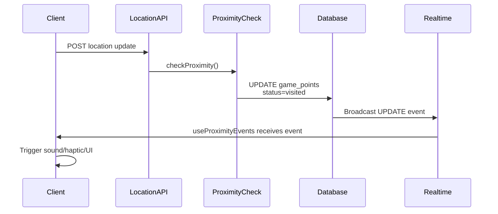

# Rich Events System - Design Document

## Decision Summary

Based on your input:

- **Timing**: After Phase 2 (multiplayer) - Phase 3+
- **Current Priority**: Not essential for single-player MVP
- **Action**: Create design document and move to roadmap

This makes strategic sense because:

1. The current Realtime infrastructure already works for proximity events
2. Rich events would benefit from multiplayer infrastructure (multiple players receiving events)
3. Fits naturally with Phase 3 achievements/rewards system
4. Allows time to gather real gameplay data before designing event types

## Current State Analysis

### Infrastructure Already in Place

Your existing Realtime setup is solid and extensible:**What Works Today:**

- Supabase Realtime enabled on `game_points`, `games`, `players` tables
- [`hooks/useProximityEvents.ts`](hooks/useProximityEvents.ts) - Client subscribes to game_points updates
- [`lib/game/proximity.ts`](lib/game/proximity.ts) - Server updates database, Realtime broadcasts automatically
- [`app/game/[id]/play/page.tsx`](app/game/[id]/play/page.tsx) - Client handles callbacks (sound, haptic, notifications)

**Key Architecture:**




### What Would Need to Change

For rich events beyond proximity, you'd need:

1. **New Database Table**: `game_events` to store dynamic events
2. **Event Generation System**: Server-side logic to create events during gameplay
3. **Client Subscription**: Extend `useProximityEvents` or create `useGameEvents` hook
4. **UI Components**: Event notification system (toast, modal, drawer)

## Event Type Possibilities

Based on your original ideas and future features:

### 1. Dynamic Objectives (High Impact)

**Critical Line Event:**

- Server analyzes game progress and remaining time
- If player is too far behind, injects a "critical line" checkpoint
- Player must reach it within time limit or game fails
- Adds tension and time pressure to gameplay
```typescript
interface CriticalLineEvent {
  type: 'critical_line';
  location: LatLng;
  deadline: Date;
  penalty: 'game_fail' | 'time_penalty';
  description: string;
}
```


**Use Case:** Player has 2 hours remaining but is 5km from goal with no waypoints visited. System adds critical checkpoint halfway.

### 2. Side Quests / Bonus Content (Medium Impact)

**Nearby POI Discovery:**

- Server monitors player location against OSM landmark database
- When player is within 200m of interesting landmark (not a waypoint), sends optional POI event
- Visiting POI grants bonus XP, achievements, or unlocks fun facts
- Non-critical, enriches exploration
```typescript
interface POIEvent {
  type: 'poi_discovered';
  landmark: {
    name: string;
    type: string; // 'historic', 'peak', 'tower', etc.
    location: LatLng;
    description?: string;
  };
  rewards: {
    xp?: number;
    achievement_id?: string;
  };
}
```


**Use Case:** Player passes near a historic site not used as waypoint. Game notifies: "Historic castle 150m north. Visit for +50 XP?"

### 3. Narrative/Flavor Events (Low Impact, High Fun)

**AI-Generated Story Beats:**

- Based on terrain, weather, time of day, player progress
- AI generates contextual flavor text
- Examples: "The forest grows dense here" when entering woods, "Storm clouds gather" if weather API shows rain
```typescript
interface NarrativeEvent {
  type: 'narrative';
  message: string;
  context: 'terrain' | 'weather' | 'progress' | 'time';
}
```


### 4. Environmental Alerts (Low Priority)

**Safety/Practical Info:**

- Weather warnings (if integrated with weather API)
- Terrain difficulty alerts (steep terrain ahead, river crossing)
- Daylight warnings (sunset in 30 minutes)
```typescript
interface EnvironmentalEvent {
  type: 'environmental_alert';
  severity: 'info' | 'warning' | 'danger';
  message: string;
  category: 'weather' | 'terrain' | 'daylight';
}
```


### 5. Trade-offs/Offers (Future Feature Integration)

From your future features list:

- "Trade time for more tips"
- "Trade tips for more time"
```typescript
interface TradeOfferEvent {
  type: 'trade_offer';
  offer: {
    give: { type: 'time' | 'hints' | 'xp'; amount: number };
    receive: { type: 'time' | 'hints' | 'xp'; amount: number };
  };
  expires_at: Date;
}
```


## Proposed Architecture

### Database Schema (New Table)

```sql
CREATE TABLE game_events (
  id UUID PRIMARY KEY DEFAULT gen_random_uuid(),
  game_id UUID NOT NULL REFERENCES games(id) ON DELETE CASCADE,
  player_id UUID REFERENCES players(id) ON DELETE CASCADE, -- NULL for all-player events
  event_type TEXT NOT NULL, -- 'critical_line', 'poi_discovered', 'narrative', etc.
  payload JSONB NOT NULL, -- Event-specific data
  status TEXT NOT NULL DEFAULT 'active', -- 'active', 'completed', 'expired', 'dismissed'
  created_at TIMESTAMPTZ DEFAULT NOW(),
  expires_at TIMESTAMPTZ, -- Optional expiration
  completed_at TIMESTAMPTZ
);

-- Enable Realtime
ALTER PUBLICATION supabase_realtime ADD TABLE game_events;

-- RLS policies
CREATE POLICY "Players can read their game events"
  ON game_events FOR SELECT
  USING (
    player_id IS NULL OR -- All-player events
    player_id = auth.uid() OR -- Personal events
    game_id IN (SELECT game_id FROM players WHERE user_id = auth.uid())
  );
```


### Event Generation Service

New file: [`lib/game/events.ts`](lib/game/events.ts)

```typescript
interface GameEventGenerator {
  // Called periodically or on location updates
  checkForEvents(
    gameId: string,
    playerId: string,
    context: GameEventContext
  ): Promise<GameEvent[]>;
}

interface GameEventContext {
  currentLocation: LatLng;
  gameProgress: {
    startedAt: Date;
    duration: number; // Total game duration
    timeRemaining: number;
    waypointsVisited: number;
    totalWaypoints: number;
    distanceToGoal: number;
  };
  playerState: {
    distanceTraveled: number;
    hintsCollected: number;
  };
}
```


### Client Hook Extension

New file: [`hooks/useGameEvents.ts`](hooks/useGameEvents.ts)

```typescript
export function useGameEvents(
  gameId: string,
  callbacks: {
    onCriticalLine?: (event: CriticalLineEvent) => void;
    onPOIDiscovered?: (event: POIEvent) => void;
    onNarrative?: (event: NarrativeEvent) => void;
    onTradeOffer?: (event: TradeOfferEvent) => void;
  }
) {
  // Subscribe to game_events table
  // Similar pattern to useProximityEvents
}
```


### UI Components

- **Event Toast**: Lightweight notifications for non-critical events (POI, narrative)
- **Event Modal**: Blocking for critical events requiring response (critical line, trade offers)
- **Event Log**: Drawer showing history of events (useful for debugging, immersion)

## Integration with Future Features

### Phase 2: Multiplayer

Rich events become more interesting with multiple players:

- **Team Events**: Critical line affects both players
- **Competitive Events**: First player to visit POI gets bonus
- **Asymmetric Events**: Different events for Player A vs Player B

### Phase 3: Achievements & Rewards

Events are perfect trigger mechanism:

- "Explorer" achievement: Visit 10 bonus POIs
- "Time Master" achievement: Complete critical line with 5 minutes to spare
- "Storyteller" achievement: Trigger 20 narrative events

### Content Ingestion System

Scraped game content could include pre-defined events:

- Historical tours might have narrative events at specific locations
- Challenge games could have required critical lines

## Implementation Estimate

**Minimal MVP** (Foundation only):

- Database table + migration: 1 hour
- Event generator skeleton: 2 hours
- Client hook + basic UI: 3 hours
- **Total: ~6 hours**

**Full Implementation** (One event type working):

- Add POI discovery (safest, non-critical): +4 hours
- Testing and refinement: +2 hours
- **Total: ~12 hours**

**Complete System** (All event types):

- Critical line logic: +6 hours
- Trade-offs system: +4 hours
- Environmental alerts: +3 hours
- Narrative generation: +4 hours
- Polish and balance: +4 hours
- **Total: ~33 hours** (spread across multiple iterations)

## Recommendation

### Move to Roadmap After Phase 2

**Update [`README.md`](README.md):**

- Remove from "Upcoming features" (line 32)
- Add to "Roadmap" section under Phase 3 as:
- "Dynamic game events system (critical objectives, side quests, narrative moments)"

**Why This Makes Sense:**

1. **Current System Works**: Proximity events via Realtime are sufficient for MVP
2. **Multiplayer Synergy**: Events become more valuable with 2-3 players
3. **Rewards Integration**: Natural fit with achievements/XP system (also Phase 3)
4. **Data-Driven Design**: Field testing will reveal which events players actually want
5. **Complexity**: Rich events add significant scope; better to perfect core gameplay first

### Preserve the Vision

Create a new file [`docs/dynamic-events-design.md`](docs/dynamic-events-design.md) containing this design document, so the ideas are captured and ready to execute when the time comes.

## Changes Required

1. **Update [`README.md`](README.md)**:

- Remove line 32 from "Upcoming features"
- Add to "Roadmap" section with Phase 3 features
- Reference the design doc

2. **Create [`docs/dynamic-events-design.md`](docs/dynamic-events-design.md)**:

- Full design document with architecture, event types, implementation notes
- Ready to be converted to a plan when Phase 3 begins

3. **Optional: Update [`.cursor/plans/wild_trails_roadmap_45ff2d4c.plan.md`](.cursor/plans/wild_trails_roadmap_45ff2d4c.plan.md)**: