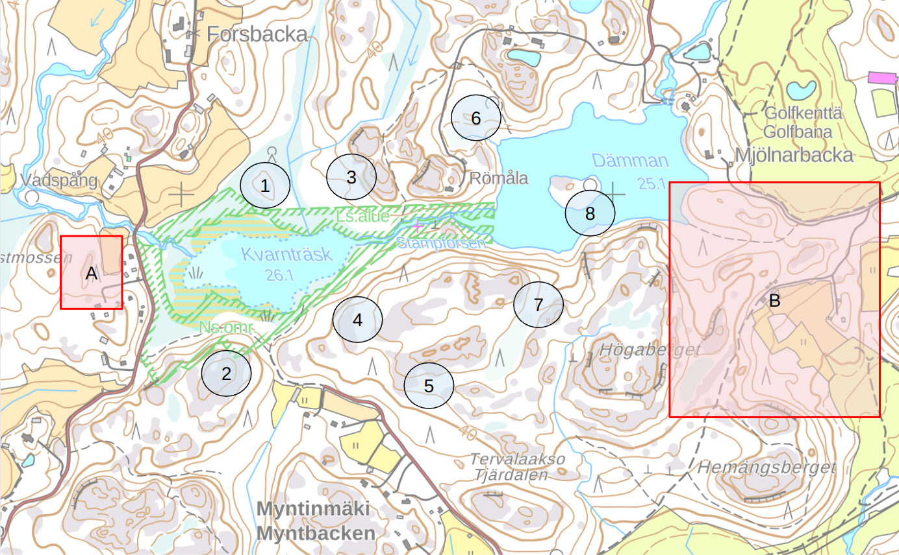

# Wild Trails - synopsis

Working title: Wild Trails

> Keywords: Human vs. nature, survival & adventure, AI, gamification, geocaching

Game is basically a more advanced version of orienteering. Each game will consist of a starting point (A) and an ending point (B). At the start of the game, the location of B is unknown. Players will have a certain amount of hours to get to point B, and direct distance between the points A and B should correlate to the amount of hours.

In between A and B, there are multiple (e.g. 2 - 10) points which the player A may choose to visit, and each point will give a hint where the B is located. These points in-between should fan-out starting from the point A, so their general direction also will guide players slowly towards the B, but shouldn’t give out the exact path or location to it.

Players can see the whole map area including point A. Player A will travel to point A, and optionally, player B should be taken to point B. Once in place, the application will allow the players to start the game. Once the game is started, users will see all of the points in-between, and they can start to head to any of them.

Once player A is close enough to a point, the application will send them a notification or a message. The message can include a direct hint about the B location, like a rough area, distance from nearest lake or other landmark, or a puzzle which has to be solved before getting the direct hint.

Game has multiple roles;
- Player A, who is the player who starts at the point A and aims to get to the goal which is the point B
- Game master is the player who will create the map, choose the points A and B, and also create the points in-between, including all the hints and puzzles.
  - Game master can be automated by the application, and does not have to be an actual player
- (Optional) Player B, who is the player at point B. When Player B is present, player B is the one who will receive the messages, notifications, and tips. They will have to solve puzzles and glues, to get the information about points in-between and their own location, which they will have to communicate to player A.
  - Game suggests that player B only would use either short messages, or short calls, not to make the game too easy, but does not limit this in any way at the moment

This game can be played with multiple players, in a following way
- Single player
  - Player takes the role of “Player A”
  - Application takes the role of “Game master”
- Two players
  - Option #1
    - Players can play the role “Player A” together
    - Application takes the role of “Game master”
  - Option #2
    - One player takes the role of “Player A”
    - Another player can choose either to be a “Game master”, or “Player B”
      - When they choose to be “Player B”, the application will take the role of a “Game master”
- Three or more players
  - Same as above, but with three players the “Game master” may take a larger role
  - Game master can plan the route ahead, and go to the forest to prepare all the points in advance, and leave supplies and physical glues to each point. With this format, the recommended game time is 24 hours.
  - Difficulty may be increased by increasing the time, and increasing the points, and by making glues harder

Players are required to have basic knowledge on how to use map and compass, and overall how to be and move in the forest. First aid knowledge is highly recommended, and in 3+ player games mandatory.

Gear can be decided between the players, but the recommended setup is to have fully charged phones, proper clothing, and a knife.

Idea is derived from a TV format called Ultimate Escape Finland, where another player is located in point B, but they don’t know their own location, and another player is dropped at point A, and this player has to get to player B. There are points between these two players and each point has supplies, which will help player A to move forward or find player B faster. Location of the supplies is not told directly to the Player B, but instead glues are given, such as “Lantern is not in the same location, as the sleeping bag”. Player B will receive tips about each point in-between and about their own location, which they will have to communicate to each other with 1 minute phone calls. They have 24 hours to find each other. Ultimately, the most difficult level of this game, should be like that.

----

Concept image of how a possible game area could look like. On the left there’s player A starting point, and on the right there’s the area where point B is located. In between, there are 8 locations which each have either supplies or clues about the point B location. In the image, clue points are separated by water, so the player most likely has to choose a path which to follow.

----

Future features:
 - Critical line + time to get to the line
 - Penalties for not achieving something, e.g. not reaching the critical line in time
 - Offers: Trade time for more tips, or trade tips for more time
 - S.E.R.E. elements?